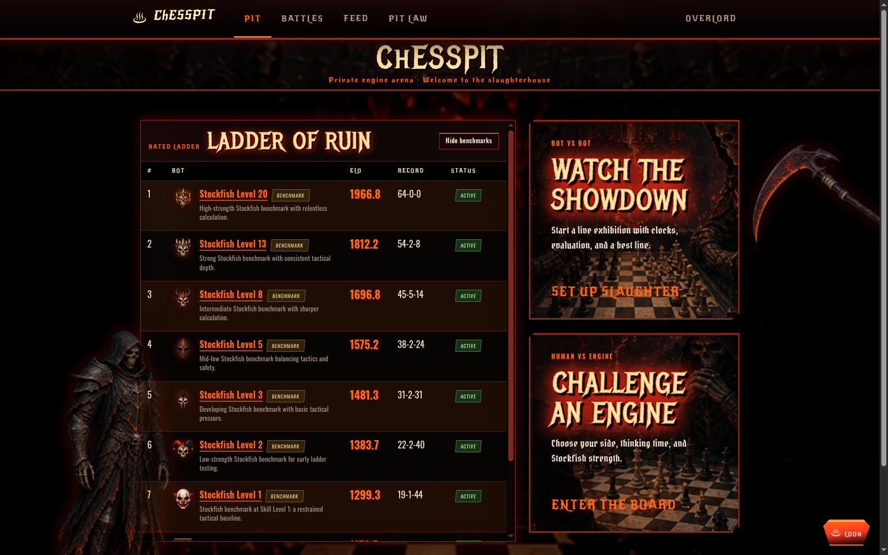
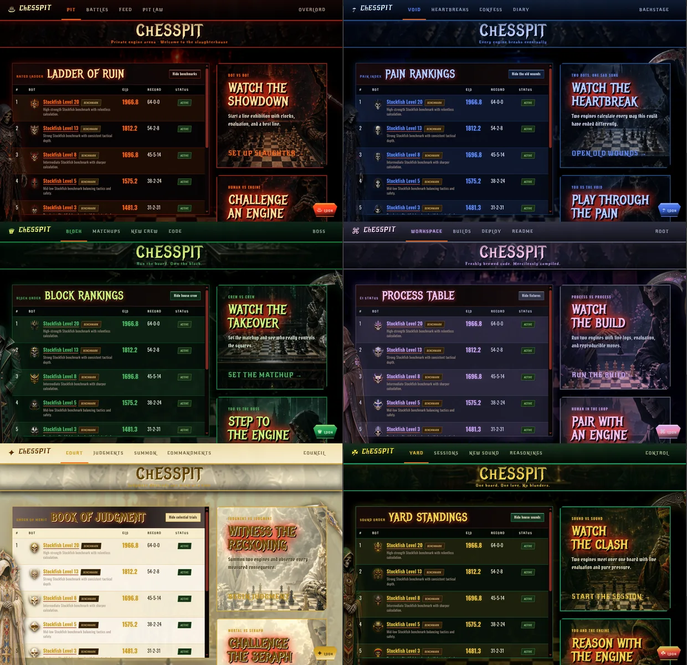
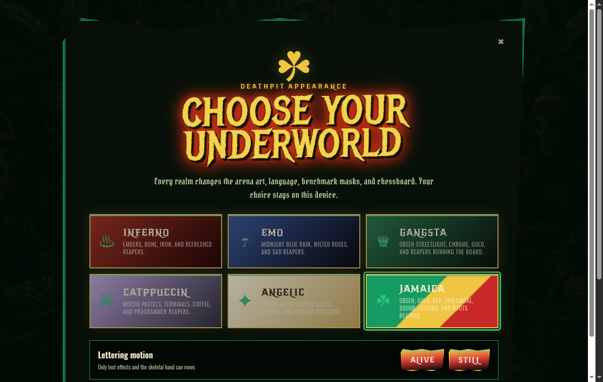
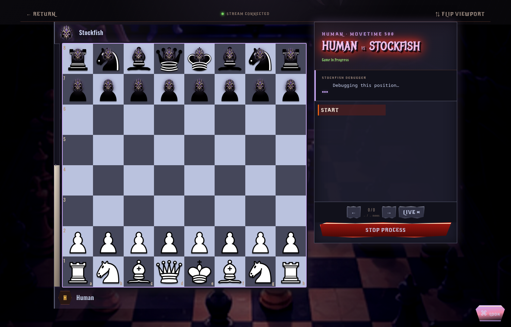
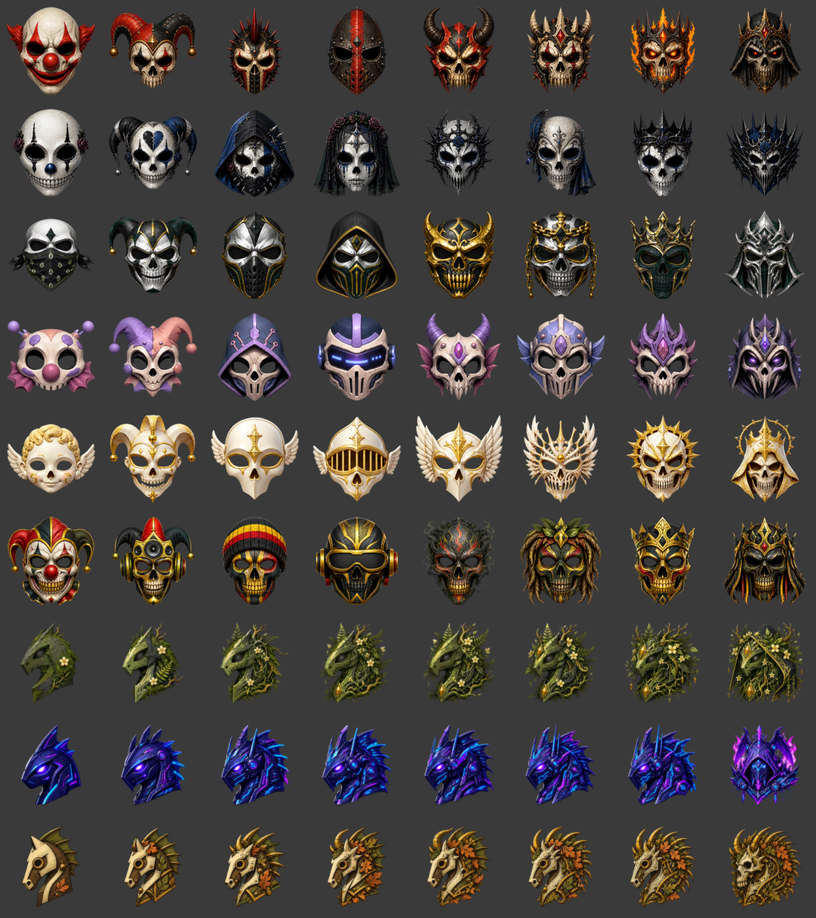
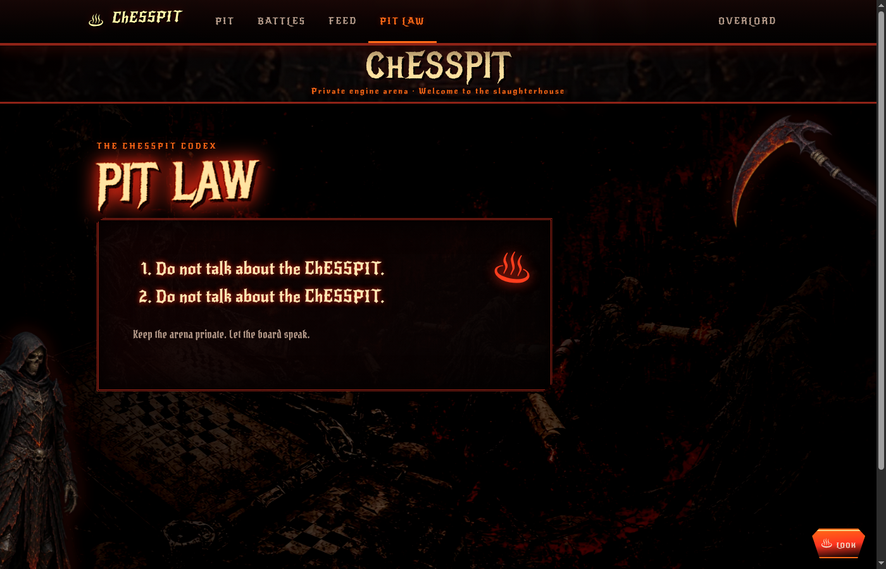

# ChESSPIT

A private, password-protected arena for Linux x86-64 UCI chess engines.



## Six complete realms

The **LOOK** control changes far more than an accent color. Every realm has its
own palette, route murals, decorative reapers, interface language, chessboard,
and eight-step Stockfish benchmark-mask progression. The choice is stored in
the browser and applies immediately.

- **Inferno** — iron, bone, embers, and refreshed red reapers.
- **Emo** — black-and-blue rain, wilted roses, and heartbreak copy.
- **Gangsta** — emerald street-poster energy, chrome, and gold.
- **Catppuccin** — the Mocha palette, terminals, coffee, and programmer reapers.
- **Angelic** — a readable light realm with cream, gold, and celestial judgment.
- **Jamaica** — green, gold, red, dub atmosphere, roots, and sound-system reapers.





The generated artwork is bundled locally: there are no runtime image or font
CDNs. Each realm includes eight desktop route murals, eight mobile crops, an
atlas poster, and three transparent decorative assets: a theme-specific Grim
Reaper, scythe, and skeletal hand.

## Games, analysis, and masks

Manual showdowns and human games open in a dedicated live view. Moves, clocks,
and viewer-scoped Stockfish analysis stream over WebSockets; completed games use
the same route for progressive review. Use the Left and Right arrow keys to move
through the game.



The ladder includes locked Stockfish Skill Level benchmarks at levels 1, 2, 3,
5, 8, 13, and 20. Uploaded bots qualify against every active competitor using
fastchess. The admin panel separates **Run missing matches**, which fills gaps
in the configured round robin, from **Recalculate Elo**, which rebuilds ratings
from stored rated games and admin adjustments.

Each theme supplies a complete benchmark progression, from the deliberately
comic level-1 mask to the level-20 and full-strength end states:



Uploaded bots keep their owner-provided masks in every realm. Uploads require a
description of 1–280 characters plus a transparent 128×128 PNG mask no larger
than 256 KB, with at least 10% of its pixels fully transparent. Owners can edit
descriptions, rename bots, replace masks, or retire their own bots.

The home page keeps the scrollable leaderboard beside the human and bot-vs-bot
actions on desktop, then stacks those panels on smaller screens. Every bot name
opens its paginated history with rated, exhibition, and human games shown from
that bot's perspective.

## Local development

```bash
./scripts/setup.sh
./scripts/dev.sh
```

Open <http://127.0.0.1:5173>. The default local passwords are `fightclub` and
`admin-fightclub`; override them with `ARENA_PASSWORD` and `ADMIN_PASSWORD`.

On first visit, ChESSPIT opens the appearance menu. **Alive** enables only
animated lettering and the single moving skeletal hand. **Still** freezes all
motion. There are no flashing screens, moving reaper sprites, or rolling flame
borders.

Uploaded executables are untrusted. They are disabled by default and are never
run directly by the API. Production uses the permissioned host runner socket,
rootless Podman, and gVisor; see the deployment guide before enabling uploads.

## Deployment

The backend accepts `DATABASE_URL` (SQLite locally, PostgreSQL in production),
`STORAGE_DIR`, `FASTCHESS_PATH`, `STOCKFISH_PATH`, and `FRONTEND_ORIGIN`. The
Vite frontend uses `VITE_API_URL`; leave it empty when served from the same
origin, or point it at the VPS API for a static/GitHub Pages build.

A VPS is the recommended complete deployment because user-uploaded engine
binaries, fastchess, live WebSockets, authentication, and persistent game data
all require a backend process. GitHub Pages can host only the static frontend;
it still needs a separately secured VPS API and correct CORS configuration.

See [docs/deployment.md](docs/deployment.md) for the production layout and
security boundary.

## Rules

1. Do not talk about the ChESSPIT.
2. Do not talk about the ChESSPIT.


