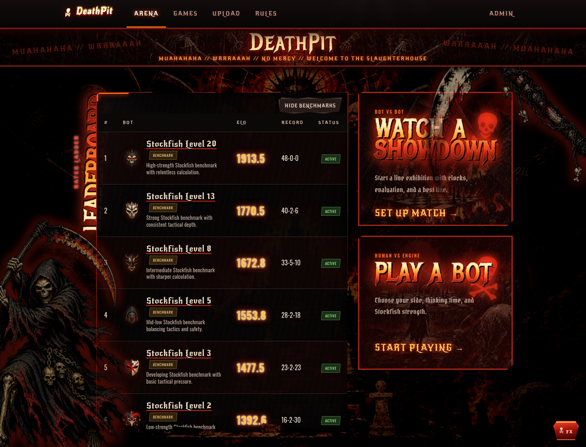
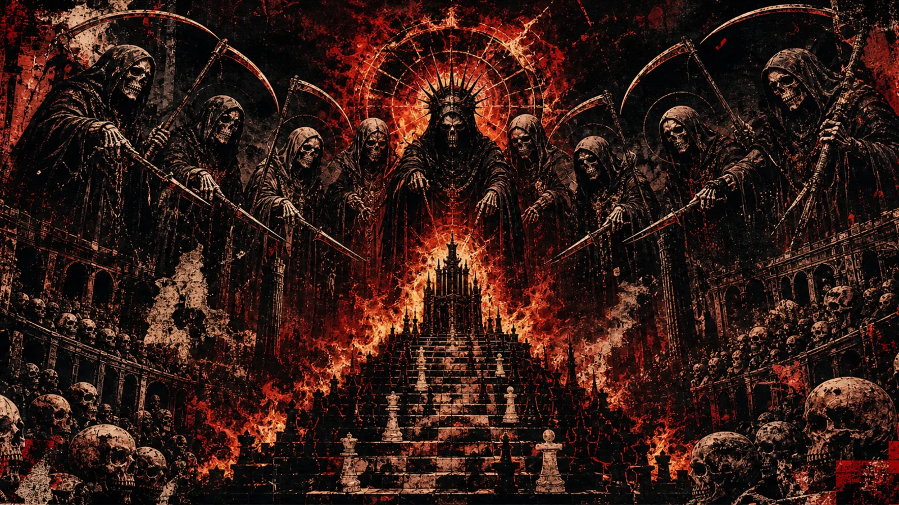
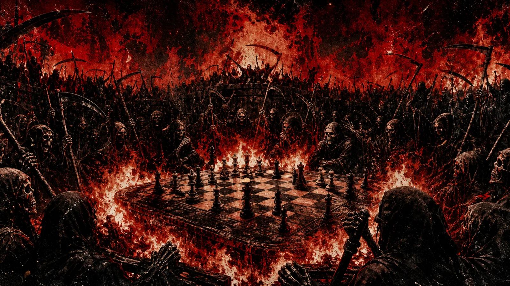
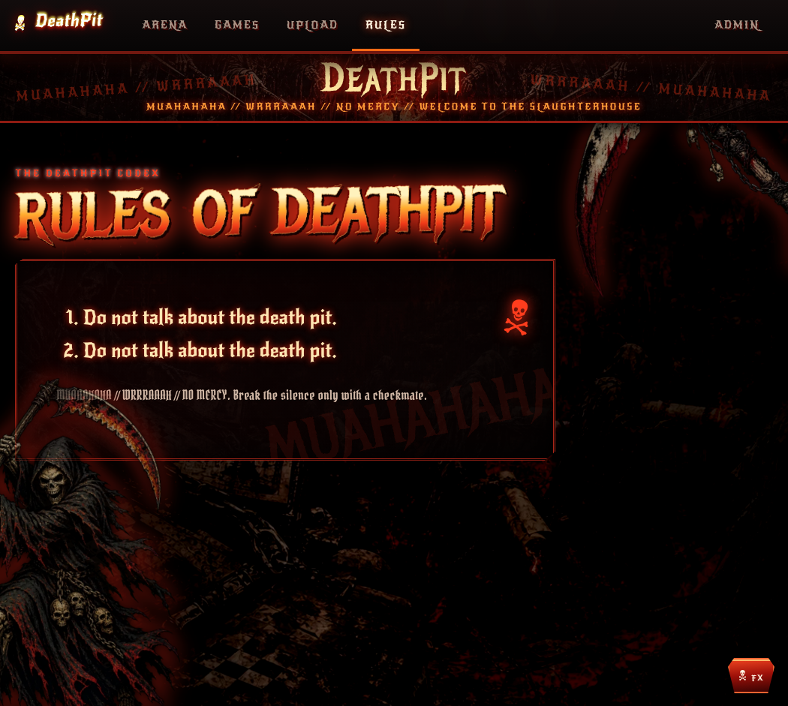

# DeathPit

A password-protected inferno for Linux x86-64 UCI chess engines. MUAHAHAHA!



The arena banner and route murals are built from the same inferno artwork used
inside the site:





## Local development

```bash
./scripts/setup.sh
./scripts/dev.sh
```

Open <http://127.0.0.1:5173>. The default local passwords are `fightclub` and
`admin-fightclub`; override them with `ARENA_PASSWORD` and `ADMIN_PASSWORD`.

Manual showdowns and human games open in a dedicated live view. Moves, clocks,
and viewer-scoped Stockfish analysis stream over WebSockets; completed games use
the same route for progressive review. Use Left and Right arrow keys to move
through the game. Rated qualification still uses fastchess.

The ladder includes locked Stockfish Skill Level benchmarks at levels 1, 2, 3,
5, 8, 13, and 20. Uploaded bots qualify against every active competitor. The
admin panel separates **Run missing matches**, which fills gaps in the configured
round robin, from **Recalculate Elo**, which rebuilds ratings from stored rated
games and admin adjustments.

The arena home keeps the leaderboard in a scrollable panel beside the Play Bot
and Watch Showdown actions on desktop, then stacks those panels for smaller
screens. Leaderboard bot names open a paginated bot history with every linked rated,
exhibition, and human game. Results are shown from that bot's perspective, and
each row opens the existing board and analysis view.

New bot uploads require a description of 1–280 characters plus a transparent
128×128 PNG mask no larger than 256 KB, with at least 10% of its pixels fully
transparent. Descriptions appear on the leaderboard and full bot history, and
owners can edit them later. Masks appear throughout the arena and cover the
face of that bot's chess pieces. Existing opaque avatars are kept inside a
jagged legacy iron faceplate until their owner uploads a mask.

The included Stockfish ladder progresses from a clown mask at level 1 through
jester, punk, executioner, demon, bone warlord, and skull masks. Full-strength
Stockfish uses the crowned reaper mask. The interface bundles its blackletter,
heavy-metal, and condensed fonts locally and does not need a font CDN.

Each browser is shown a photosensitivity warning before visual effects begin.
**Enter the inferno** enables animated text and one moving skeletal hand;
**Use static carnage** freezes every effect. There are no flashing screens or
rolling flame borders. The skull-shaped **FX** control reopens this choice.

Uploaded executables are untrusted. Local mode uses process resource limits and
is intended only for binaries you trust. Production must set `RUNNER_MODE=podman`
or `RUNNER_MODE=gvisor` on a dedicated Linux VPS.

## Deployment

The backend accepts `DATABASE_URL` (SQLite locally, PostgreSQL in production),
`STORAGE_DIR`, `FASTCHESS_PATH`, `STOCKFISH_PATH`, and `FRONTEND_ORIGIN`.
The Vite frontend uses `VITE_API_URL`; leave it empty when served from the same
origin, or point it at the VPS API for a static/GitHub Pages build.

See [docs/deployment.md](docs/deployment.md) for the production layout and
security boundary.

## Rules

1. Do not talk about the death pit.
2. Do not talk about the death pit.

The same rules are available in the site under **Rules**. MUAHAHAHA. WRRRAAAH.
